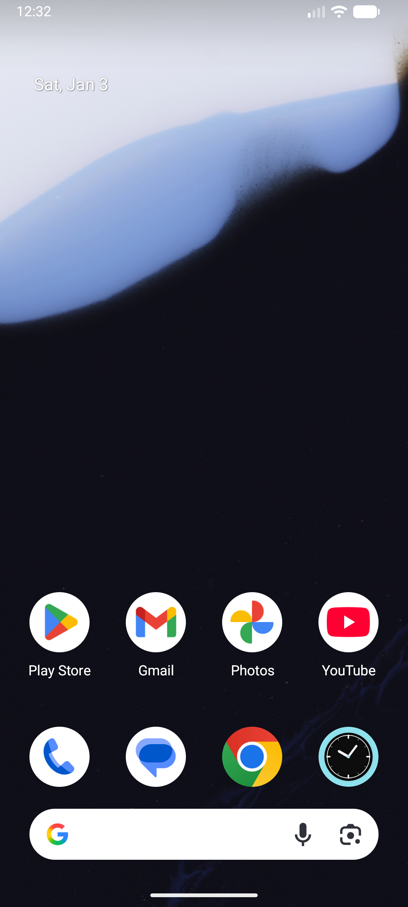

# OnScreen-Light 📱


**OnScreen-Light** is a lightweight, open-source Android utility that turns your phone screen into a **front-facing fill light**.  
Ideal for video calls, selfies, night usage, and devices without a front camera flash.

---

## 💡 Why OnScreen-Light?

Many Android smartphones do not include a **front camera flash**.  
OnScreen-Light solves this by displaying a bright, adjustable light overlay that stays **on top of other apps**.

### Perfect for:
- 📞 WhatsApp, Zoom, Google Meet video calls  
- 🤳 Low-light selfies  
- 🌙 Night light usage  
- 🎥 Content creators & streamers  

---

## 🚀 Features

- ✅ **Display Over Other Apps**  
  Light stays active while using camera or video apps

- 🎨 **Adjustable Light Color**  
  Choose the tone that suits your environment

- 🔆 **Brightness Control**  
  Easily control light intensity

- 🪶 **Lightweight & Fast**  
  Small APK size with low battery consumption

- 🔓 **Fully Open Source**  
  No ads, no tracking, no background services

---

## 📸 Screenshots

<p align="center">
  
  &nbsp;&nbsp;&nbsp;
  
</p>

---

## 📥 Download APK (Ready to Use)

👉 **Direct APK Download**  
[⬇️ Download OnScreen-Light v1.0](OnScreen-Light-v1.0.apk)

---

## 🛠️ Build From Source

This project includes the **Gradle Wrapper**, so you do **NOT** need to install Gradle manually.

### Requirements
- Android Studio (latest stable)
- JDK 17 (bundled with Android Studio is OK)

---

## 🔧 Build Using Android Studio

1. Clone the repository:
   ```bash
   git clone https://github.com/0xrohitsen/OnScreen-Light.git
   ```

2. Open **Android Studio**
3. Click **Open** → select the `OnScreen-Light` folder
4. Wait for **Gradle Sync**
5. Click ▶ **Run** or:
   - Build → Build Bundle(s) / APK(s) → Build APK(s)

APK output:
```
app/build/outputs/apk/debug/
```

---

## 🔧 Build Using Terminal (Linux / macOS)

```bash
cd OnScreen-Light
chmod +x gradlew
./gradlew assembleDebug
```

---

## 🔧 Build Using Windows

```bat
gradlew.bat assembleDebug
```

APK output:
```
app\build\outputs\apk\debug\
```

---

## ❗ Common Issue

**gradle command not found?**  
✅ Use:
```
./gradlew
```
or on Windows:
```
gradlew.bat
```

---

## 🔐 Required Permission

- **Display over other apps** (required for overlay)

---

## 📱 Compatibility

- Android 8.0 (Oreo) and above
- Phones & tablets
- No root required

---

## 📂 Project Structure

```
OnScreen-Light/
├── app/
├── images/
│   ├── app_icon.png
│   └── main_screen.png
├── gradle/
├── gradlew
├── gradlew.bat
├── build.gradle.kts
├── settings.gradle.kts
├── OnScreen-Light-v1.0.apk
├── README.md
└── LICENSE
```

---

## 🤝 Contributing

1. Fork the repository  
2. Create a new branch  
3. Commit your changes  
4. Open a Pull Request  

---

## 📄 License

MIT License — see [LICENSE](LICENSE)

---

## ⭐ Support

If this project helps you:
- ⭐ Star the repo
- 🐞 Report issues
- 💡 Suggest features

Made with ❤️ for the Android open-source community.
